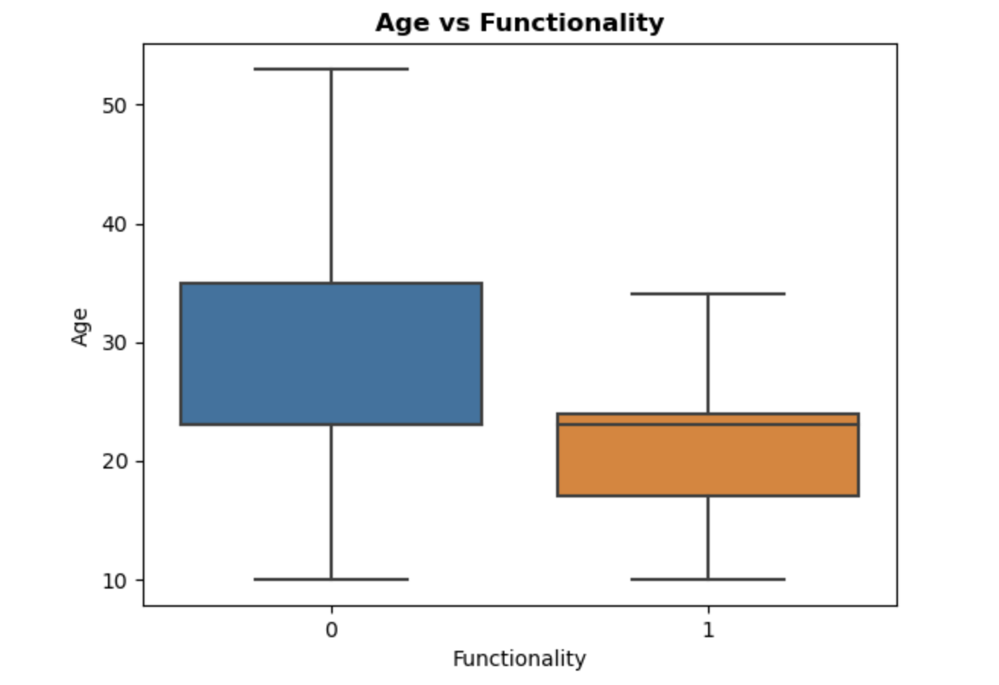
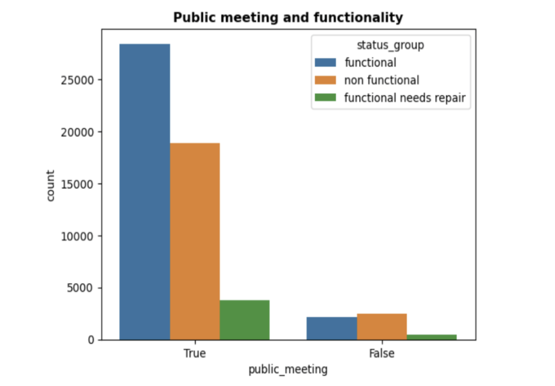
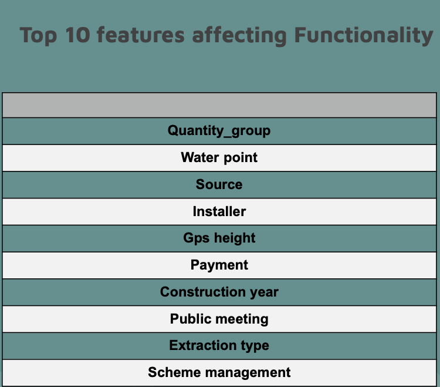

# Tanzanian Water Wells
#### Water pump functionality in rural schemes

# Background 
Tanzanzia is a developing country located in the east of Africa, the country has a population of 67.4 Million, with a GDP of $67.8 Billion  and an economic growth rate of 6% by 2025. The goal of this project is to address some important UN sustainable dev goals in Tanzania. Those are associated to water access, water sanitation and poverty reduction as water has direct relationship to crop growth, health, societal participation and decreased school attendance for young boys and girl which affects their development. The mission of this project is to identify areas with high correlation to a pumps functionality, from this identification this project will then recommend actions to take to improve water access and create a model to create efficiency in handling future pump status based on it's features.

# Data Understanding 
The data used in this assesment was found at datadriven.org and retrieved from the government of Tanzania and Taarifa. The information had duplicate entries and within the [EDA file](https://github.com/Danayt09/Tanzanian_Water_Wells/blob/main/EDA.ipynb), after cleaning anf analyzing the data these were the features i found important:

1. date_recorded -- The date the row was entered          
2. funder -- Who funded the well                 
3. gps_height -- Altitude of the well            
4. installer
5. basin -- Geographic water basin                  
6. region -- Geographic location                
7. population -- Population around the well        
8. public_meeting -- True/False                  
9. permit -- If the waterpoint is permitted              
10. construction_year -- Year the waterpoint was constructed     
11. extraction_type_class -- The kind of extraction the waterpoint uses
12. management_group -- How the waterpoint is managed     
13. payment -- What the water costs              
14. water_quality -- The quality of the water    
15. quantity  -- The quantity of water            
16. source  -- The source of the water                      
17. waterpoint_type_group -- The kind of waterpoint
18. status_group -- Functionality status           
19. age_of_well  -- Age from time of construction

The information includes the communities participation, regulators matters that can affect a pump, such as permit, and functionality starting from water source, installer, the year of construction, height of pump from ground and the rest mentioned in the list. 

# Important Findings 
#### Age of Well:
Not too surprisingly i found that age was a determinant factor and had great influence in a pumps functionality, newer wells had greator functional numbers compared to non functional well where majoprity were older. This highlight the lack of proactive managment and as a venture to address water access to rural areas of Tanzania, it's important to realize the steps needed past installment. 

#### Publics meeting:
Areas which had public meetings were most likely to have water access and a functional water pump than those that didn't have meetings. This leads us to advocate for people empowerment and education towards action for better results, compared to outsoide intervention. 

#### Adopting this model:
The model created in the [/ModelNotebook](https://github.com/Danayt09/Tanzanian_Water_Wells/blob/main/Final_Notebook.ipynb) is a predictive model that states a wells functional status given it's features. The model is currenty 74% accurate meaning it'll predict the actual status of a well accurately 74% of the time, with great room for improvement as this was done in a weeks worth of time. Consistent with the above analysis the top ten features I found most influential were as follows:

# Recommendations:

>- Community engagement
>- Proactive Maintenance
>- Adopting This Model 

#### Next Steps:
Improve the model with better data and tuning, create a multi class as this is binary for those needing repair and functional repairs while data includes 3 classes with those needing repairs being non-functional and a 7% of them Functional that needs a repair. 

Identify micro-lending possibilities, an important finding was the influence of community building and another fact that can be found in the [presentation](https://github.com/Danayt09/Tanzanian_Water_Wells/blob/main/Tanzanian%20Water%20Wells.pdf) is that some form of payment has association with a functional well, rather than those who didn't pay. And micro lening is a great financial tool to create a self sufficient communiuty. 

#### Limitaions:

It is important to note that this is a binary model and the original data was ternary. 
